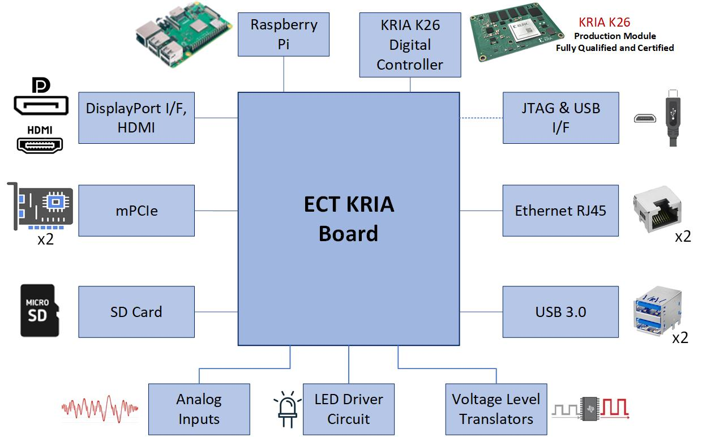

# Ectron KRIA Evaluation Kit (ECT-KRIA-EVK)

On this project I **led a full development cycle with board bring-up** for one of the most powerful **IoT development kits** on the market for **Edge computing** applications. It is built around the powerful **Kria SOM** from **AMD**, based on **Zynq UltraScale+ MPSoC FPGA with quad core 64-bit ARM processor**. The board runs **Ubuntu Linux** and is offered as stand-alone product with **4G/LTE Radio + SIM and CORAL TPU**, or as an **Edge Computing or IoT Kit** with a suite of **industrial-grade sensors**.
It is targeting such applications as **Edge Computing with AI/ML, Industrial Machinery, COTS MIL, General Purpose Edge Gateways, Factory and Building Automation, Smart Grid and Energy Monitoring, Automotive Applications, Defense Applications**.

### My Role
- **Schematics** review and modifications across multiple board revisions.
- **Vivado FPGA design development**.
- **Embedded C** *Build-In-Self-Test application* implementation in **Vitis**, customizing **First-Stage-Boot Loader (FSBL)** and **Board Support Package (BSP)**.
- Full **board bring-up** with hardware board debugging and verification as a system.
- Creating **PetaLinux** built for boot image.
- Technical and **documentation** support, **mentoring** junior developers.

### Tools & Technologies
Vivado, Vitis, Zynq UltraScale+ MPSoC FPGA, KRIA SOM, Verilog, Embedded C, Firmware development, BIST, Board Bring-up, FSBL, BSP, Petalinux, hardware verification, PCIe, Gigabit Ethernet, DisplayPort, HDMI.

   
##
**EСT-KRIA-EVK Board High Level Block Diagram:**

**EСT-KRIA-EVK Product Brief:**
You can view the [product brief](01EСT-KRIA-EVK Product Brief.pdf) for more detailed information.

**ECT-KRIA Board Foto (Front):**
.jpg)

**ECT-KRIA-EVK Board Interfaces Connection Diagram:**

**ECT-KRIA-EVK Powered up Board Photo:**

**ECT-KRIA-EVK Ubuntu with Display Port Output to Monitor:**

**Vivado Block Diagram:**

**ECT-KRIA-EVK High Level Block Diagram:**

**ECT-KRIA-EVK Board Detailed Block Diagram:**

**MPSOC Configuration:**

**MPCIe2 (TPU) Eye Scan using Integrated Bit Error Ratio Tester (IBERT):**
 Eye Scan using Integrated Bit Error Ratio Tester (IBERT).png)

**Si5332 8-channel Clock Generator Configuration:**

**High Level I2C Bus Configuration:**

**K26 SOM:**
